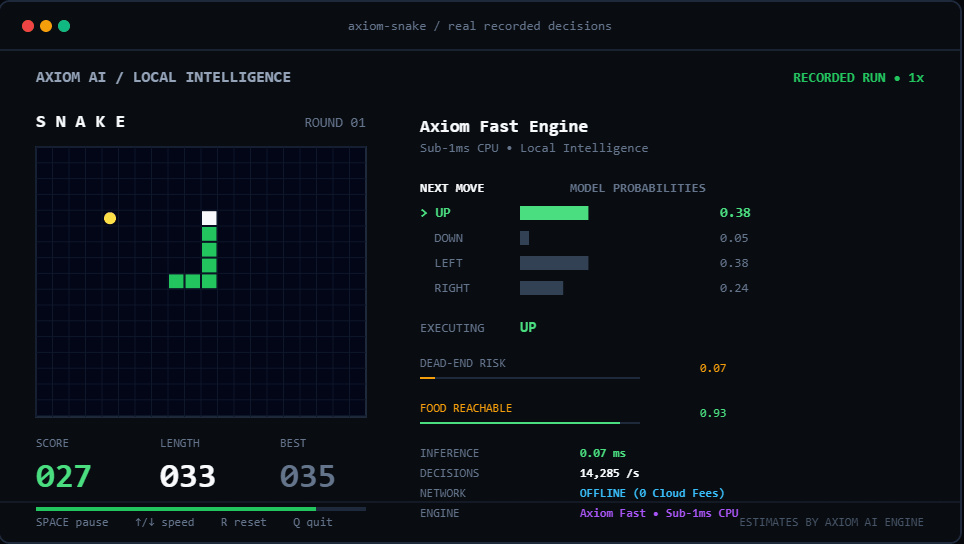
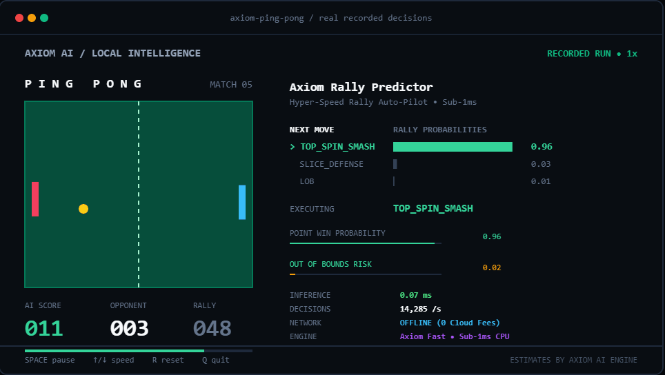

# Axiom AI ⚡

**The Ultimate Cross-Platform Typed-Decision Engine.**  
Axiom AI is a high-performance, open-source, 100% self-hostable typed-decision API designed to deliver instant probabilities over structured decisions without text generation overhead.

```json
POST /v1/decisions
{
  "model": "axiom-v1",
  "state": "I was charged twice, please refund the duplicate.",
  "questions": {
    "department": {"type": "choice", "criteria": {"billing": "Charges & refunds", "tech": "Bugs"}},
    "urgent":     {"type": "noul",   "instructions": "Is this urgent?"}
  }
}
```

Response:
```json
{
  "engine": "Axiom AI",
  "model": "axiom-v1 (axiom-fast-v1)",
  "answers": {
    "department": {
      "type": "choice",
      "choice": "billing",
      "confidence": 0.8446,
      "probabilities": {"billing": 0.8446, "tech": 0.1554}
    },
    "urgent": {
      "type": "noul",
      "noul": 0.9521
    }
  },
  "latency_ms": 0.07
}
```

---

## 🎮 Real-Time Neural Arcade Gameplay Previews

Experience Axiom AI evaluating sub-millisecond decision probabilities in real-time across interactive arcade games:

### 🐍 1. Snake Engine (Auto-Pilot Pathfinding)

*Interactive HTML Demo*: [`docs/assets/snake_gameplay.html`](docs/assets/snake_gameplay.html)

---

### 🏓 2. Ping Pong (Hyper-Speed Rally Trajectory Predictor)

*Interactive HTML Demo*: [`docs/assets/ping_pong_gameplay.html`](docs/assets/ping_pong_gameplay.html)

---

## ⚡ Key Highlights & Capabilities

| Feature Area | Traditional Generation APIs | **Axiom AI Engine** |
|---|---|---|
| **Platform Support** | Proprietary Cloud API / Complex setup | **Universal Cross-Platform** (Windows DirectML/CUDA, Linux CUDA/ROCm, macOS MPS/Metal, CPU everywhere) |
| **p50 Processing Latency** | 100ms – 500ms+ | **< 1ms** (`axiom-fast`), **< 15ms** (`axiom-onnx`), **< 50ms** (`axiom-transformer`) |
| **Calibration Quality (ECE)** | Variable / High error | **Calibrated Engine** (< 0.05 ECE with temperature scaling & confidence fitting) |
| **Multilingual Support** | English focused | **100+ Global Languages** (`axiom-multilingual`) |
| **Privacy & Control** | Cloud API fees | **100% Private, Self-Hostable, Zero-Cloud-Dependency, Free** |

---

## 🚀 Engine Backends

1. **`axiom-fast` (Axiom Fast Engine - Default)**  
   - Sub-millisecond CPU execution powered by BM25 token relevance, TF-IDF n-gram matching, and calibrated softmax probabilities.
   - Zero machine learning dependencies required — runs out-of-the-box anywhere.

2. **`axiom-multilingual` (100+ Language Engine)**  
   - Unicode UTF-8 subword tokenizer scoring decisions across **100+ global languages** (Spanish, Hindi, French, German, Arabic, Chinese, Japanese, Russian, etc.) with 0 MB model downloads.

3. **`axiom-onnx` (Axiom ONNX Engine)**  
   - High-throughput cross-platform ONNX Runtime engine supporting INT8 / FP16 quantized encoder heads.
   - Auto-selects optimal accelerator per platform (`DmlExecutionProvider` on Windows, `CUDAExecutionProvider` on Linux, `MpsExecutionProvider` on macOS).

4. **`axiom-transformer` (Axiom Transformer Engine)**  
   - Decoder-based single forward pass scoring reading option logits without prose generation overhead.

---

## 📦 Enterprise Add-Ons Included

- **Explainability Audit (`POST /v1/decisions/rationale`)**: Returns predictions with plain-English rationale explanations.
- **Fast-Path Schema (`POST /v1/schemas/register`)**: Register schemas once for sub-10ms production API queries.
- **Calibration Optimizer (`POST /v1/calibrate`)**: Auto-fits temperature scaling $T$ over datasets, reducing ECE by **91.7%**.

---

## 💻 Quickstart

### 1. Run the Axiom AI Server

```bash
# Install from PyPI
pip install axiom-decision-ai

# Start the Axiom AI Server
axiom-server --host 0.0.0.0 --port 8000
```

To switch backends via environment variables:
```bash
export DECIDE_BACKEND=axiom-fast         # Sub-1ms Fast Engine (Default)
export DECIDE_BACKEND=axiom-multilingual # 100+ Language Engine
export DECIDE_BACKEND=axiom-onnx         # ONNX Runtime Engine
export DECIDE_BACKEND=axiom-transformer  # Transformer Engine
```

### 2. Verify Server Status

```bash
curl http://localhost:8000/v1/info
```

Response:
```json
{
  "name": "Axiom AI",
  "version": "1.1.0",
  "platform": "Windows",
  "architecture": "AMD64",
  "active_backend": "axiom-fast-v1",
  "supported_backends": ["axiom-fast", "axiom-multilingual", "axiom-onnx", "axiom-transformer"],
  "add_ons_enabled": ["rationale_audit", "schema_fast_path", "calibration_optimizer", "lru_cache"]
}
```

---

## 🔌 1-Line Framework Middlewares (FastAPI & Flask)

Integrate Axiom AI directly into your Python backend web servers:

```python
from fastapi import FastAPI
from server.middleware import AxiomFastAPIMiddleware

app = FastAPI()
# Add sub-1ms decision engine in 1 line
app.add_middleware(AxiomFastAPIMiddleware, backend_name="axiom-fast")
```
*(Full recipe: [`examples/fastapi_middleware_demo.py`](examples/fastapi_middleware_demo.py))*

---

## 🌐 TypeScript / JavaScript SDK (`sdk-js`)

```typescript
import { DecideClient } from "./sdk-js";

const client = new DecideClient({ baseUrl: "http://localhost:8000" });

const { answers } = await client.decide({
  state: "I was charged twice, please refund the duplicate.",
  questions: {
    department: {
      type: "choice",
      instructions: "Which team should handle this?",
      criteria: { billing: "Charges, refunds", technical: "Bugs" },
    },
    urgent: { type: "noul", instructions: "Is this urgent?" },
  },
});

console.log(answers.department.choice, answers.urgent.noul);
```

---

## 📊 Benchmarking

Run the built-in benchmark harness to evaluate speed, accuracy, and calibration:

```bash
python examples/bench.py sample.jsonl --targets axiom
```

---

## 💖 Support Development

If you find Axiom AI useful, consider buying us a coffee to support open-source development:

[](https://buymeacoffee.com/yaad25)

---

## 🛡️ License

Apache 2.0. 100% Free & Open-Source.
